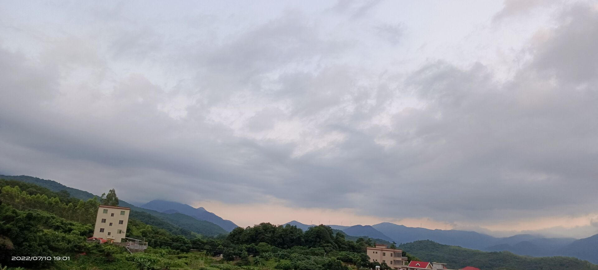

## 7.10

副高依旧控制着东南，气温直上33摄氏度。窗外没有一丝的云，暑假过去了两个星期。没有什么进展。结束了连绵的雨季，转眼副高伸展出来才有了盛夏的滋味。骚动，难以平和。  
一切都显得那么有生机，奔向田野，那时片野草统治的世界，有空闲的地方稍不管理就重新被草覆盖。烈日虽让草瘦弱的叶片显得无精打采，但不知道的是，它们才是夏日的主人啊！  
风稍拂过，草随风舞动，发出沙沙的响——那是芒。那尤为长的叶片边缘极为锋利，打退了想进犯的动物。那冲上天泛黄好似麦的穗，在众叶中如此惊艳。生活于田野边缘，同其他植株分离开来。   
在家中，显得无所事事。翻阅资本论，也草草理解着何为商品。c语言的学习还在进行。而眼下菲东的热带云团发展得娇弱尚不清楚是否能够带来点降雨。或许到台湾近海就夭折了。  
想着未来，却无心想着未来。

2022.7.10

---
[返回上一页](https://storm-1614.github.io/blog-other/)  
[返回到主页](https://storm-1614.github.io/)
