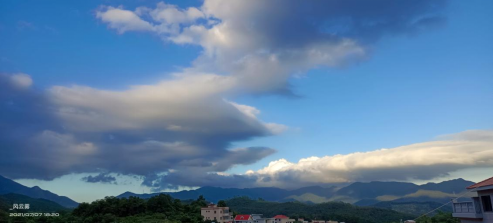

## 2022年杂记
起于2022而傲，创于夏日，时为七月十日

### 5.10
梅雨日的开始  
冷暖空气的交汇  
总是有西南的暖湿气流打扰  
相互影响，雨落纷纷  
撑起小伞  
走在小巷  
迈着小步  
失措间，踏入水潭  
水溅迷离  
不久即停  

### 5.12
黄梅时节，雨如细绳  
道如河流，天如灰布  
笔尖划过，便是青春  
那是季风，也是归去  
不知归来，未觉散去  
待晓  
一场空  

### 5.17
夏日已至，时还未归。  
气温稍凉，微风不燥。  
台海依冷，海风奔南。  
辗转向东，锋芒切变。  
大洋未涌，似如太平。  
不久当如，往昔同般。  

### 5.21 小满节气
麦粒渐满，天忽小雨;  
告白之时，不过如此。  
远方，是百亩稻田;  
近处，是花落龙眼。  
行于田垄，草渐茂盛;  
走上道路，车来人去。  
告白，在这恰好的年纪，  
也仅仅是告白。  
小满，非秋分。  
待到叶黄凋落时，  
也便是丰收时。  
无非难于离，  
却敞开新的道路，  
光明总有失落处。  
却话往昔，不觉泪落，  
但看燕天飞，晚霞粉片天！  

### 5.29 忆·去年七月七
那刻，低压支离破碎  
那刻，低压撞向大陆  
没有风雨  
只剩晴天与瀚云  
去年七月  
未有视觉盛宴  
却留下图片  
青春的字节  

### 6.25
窗外盛云，如鲲鹏展翅之旺  
室内只剩风声，笔尖下落，夏日已至。  
生态之疑，迎难而解。  
人不负青山，青山定不负人。  

> 以上为节选，还有60%不便上传  

---
### .

---
[返回到主页](https://storm-1614.github.io/)

